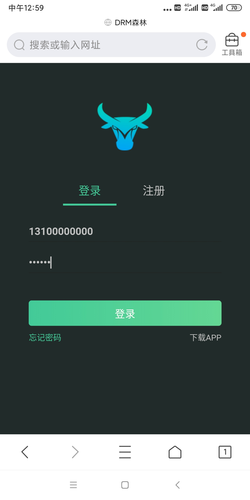
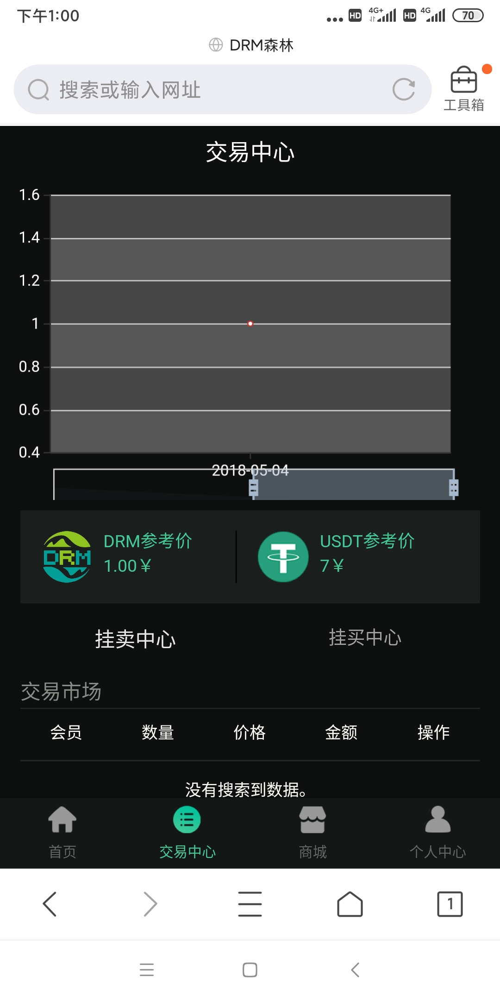
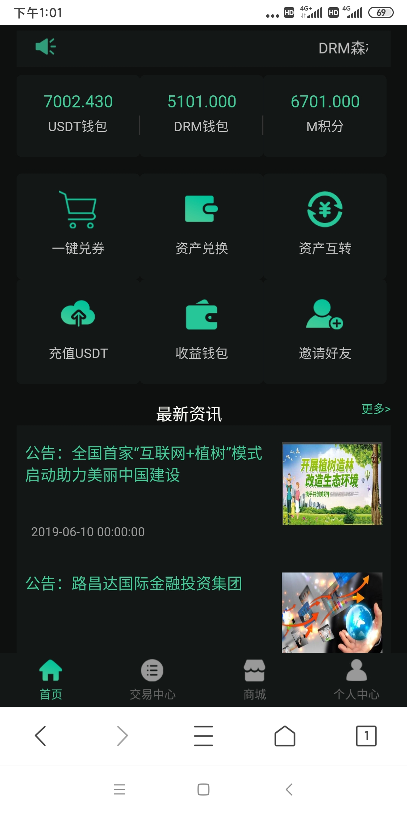
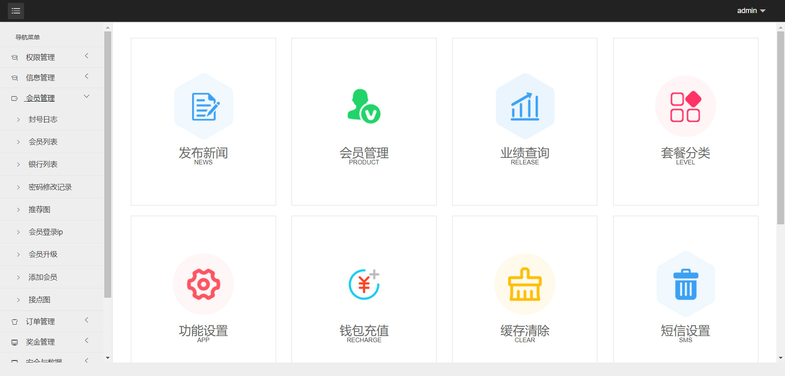

# dtoken
DToken全新钱包区块链 推荐制度 理财 源码

演示地址：https://dtoken.waps.eu.org

测试账号：13100000000

一级密码：123456

Ver 2.02 版本

1: 此钱包基于TP3.2.3的内核。

2: 修复PC和H5端版本冗余的js以及Css，流畅度和体验性更好。

3: 优化手机版界面以及众多bug。

4: 增强主流浏览器兼容性。

5: 修复多处存在sql注入的漏洞。

6: 移除几处处base64编码后门。

## Screenshots

# 声明

1. 使用本系统方必须在国家相关法律法规范围内并经过国家相关部门的授权许可，禁止用于一切非法行为。

2. 本系统限于测试、实验、研究为目的，禁止用于一切商业运营，本团队不承担使用者在使用过程中的任何违法行为负责。

3. 源码以演示站为准。

